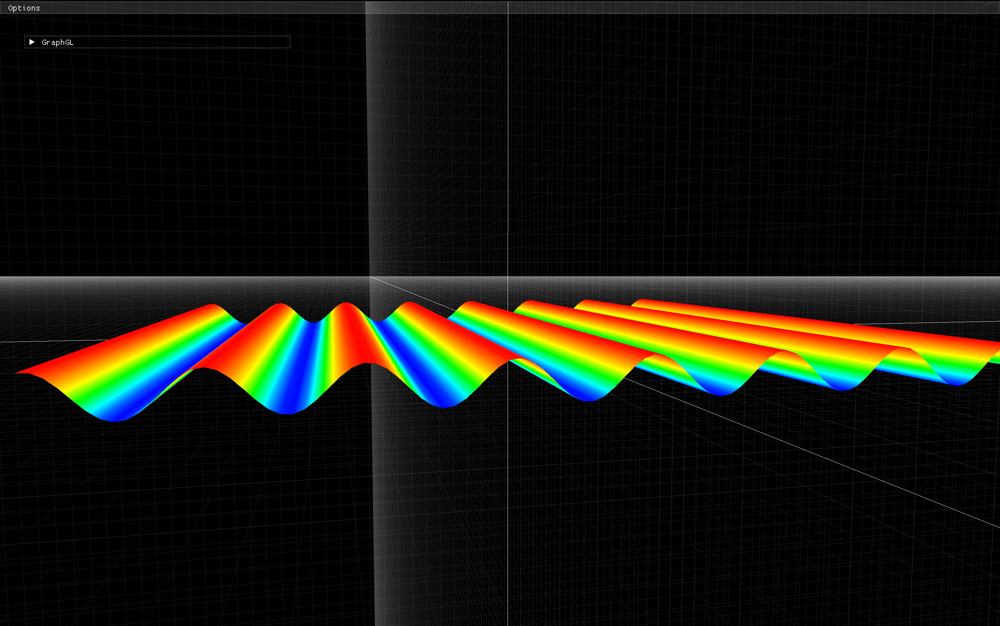
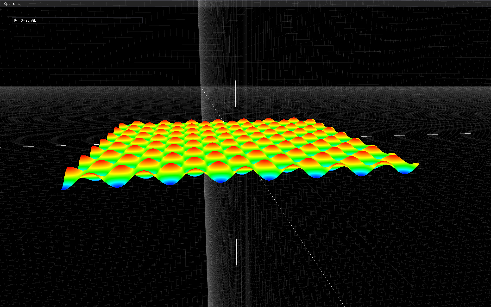
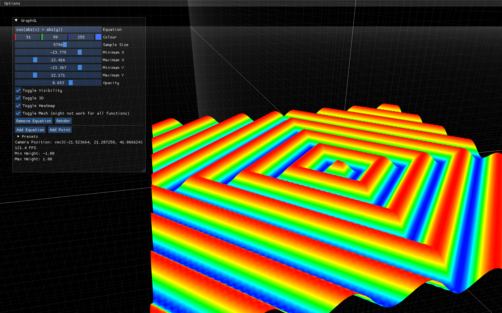
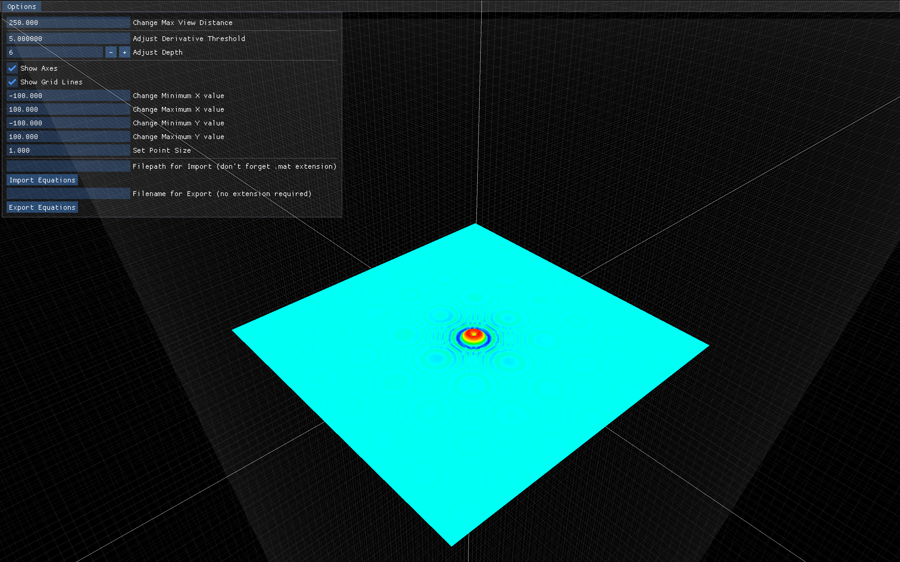

# GraphGL

A interactive 2D/3D equation graphing application built with C++17 and OpenGL.

## Screenshots

| | |
|---|---|
|  |  |
|  |  |

---

## Installation

```sh
# Clone (with submodules)
git clone --recursive https://github.com/Adel-Ayoub/GraphGL.git
cd GraphGL

# Build
make                        # debug build
make BUILD_MODE=release     # release build

# Run
make run
# or
./build/graphgl
```

---

## Requirements

- C++17 compiler (GCC, Clang, or MSVC)
- GLFW 3
- GLM
- OpenGL 3.3+

### macOS (Homebrew)
```sh
brew install glfw glm
```

### Ubuntu/Debian
```sh
sudo apt install libglfw3-dev libglm-dev
```

Bundled libraries (git submodules): ImGui, ExprTk, stb, GLAD.

---

## Features

### Rendering
- **Equation Graphing**: Parse and render arbitrary math expressions (`sin(x)`, `x^2 + y^2`, etc.)
- **2D & 3D Modes**: Switch between 2D curves and 3D surfaces
- **Adaptive Sampling**: Automatic subdivision for accurate curve representation
- **Mesh Mode**: Triangulated surface rendering for 3D equations
- **Heatmap Coloring**: Height-based color gradient visualization

### Interaction
- **3D Camera**: Orbit, pan, zoom, and roll with keyboard/mouse
- **ImGui Control Panel**: Real-time equation editing, color picking, and settings
- **Equation Presets**: Built-in examples (Ripple, Saddle, Hemisphere, etc.)
- **Import/Export**: Save and load equations/points in `.mat` format
- **Screenshot**: Save viewport to PNG with F12

### CLI Options
- `--width <int>` Window width (default: 1280)
- `--height <int>` Window height (default: 720)
- `--title <string>` Window title (default: GraphGL)
- `--file <path>` Auto-import a `.mat` file on startup
- `--help` Show usage

---

## Controls

| Key | Action |
|-----|--------|
| `W/A/S/D` | Move camera |
| `Space / C` | Move up |
| `Ctrl / X` | Move down |
| `Q / E` | Roll left / right |
| `I` | Reset camera to origin |
| `` ` `` / `TAB` / `M` | Toggle mouse look |
| `H` | Toggle heatmap |
| `F12` | Save screenshot |
| `Escape` | Quit |

---

## Usage Examples

### Basic Usage
```sh
# Start with default settings
./build/graphgl

# Start with custom window size
./build/graphgl --width 1920 --height 1080

# Start and auto-import equations
./build/graphgl --file my_equations.mat
```

### In the Application
```
1. Type an equation in the input field (e.g. sin(sqrt(x^2 + y^2)))
2. Click "Render" or modify parameters to update
3. Toggle "3D" checkbox for surface mode
4. Press H for heatmap coloring
5. Use WASD + mouse look (` key) to navigate
6. Press F12 to save a screenshot
```

### Preset Equations
The UI includes a "Presets" menu with ready-to-render examples:

| Preset | Expression | Mode |
|--------|-----------|------|
| Sine Wave | `sin(x)` | 2D |
| Parabola | `x^2` | 2D |
| Ripple | `sin(sqrt(x^2 + y^2))` | 3D |
| Saddle | `x^2 - y^2` | 3D |
| Hemisphere | `sqrt(25 - x^2 - y^2)` | 3D |
| Waves | `sin(x) * cos(y)` | 3D |
| Egg Carton | `sin(x) + sin(y)` | 3D |

---

## Import/Export Format

The `.mat` file format stores equations and points as plain text:

```
Equation "r g b sampleSize minX maxX minY maxY visible is3D expression"
Point px py pz r g b
```

### Example
```
Equation "1 0.5 0.2 1000 -25 25 -25 25 1 1 sin(sqrt(x^2 + y^2))"
Equation "0 0.8 0.3 1000 -10 10 -10 10 1 0 x^2"
Point 0 5 0 1 0 0
```

---

## Architecture

```
src/
├── main.cpp               Entry point and CLI argument parsing
├── application.cpp         Main loop, input, subsystem wiring
├── camera.cpp              3D camera (orbit, pan, zoom)
├── renderer.cpp            Base OpenGL renderer
├── equation_renderer.cpp   Equation/point draw calls
├── grid_renderer.cpp       Grid and axis overlay
├── equation_parser.cpp     Expression parsing (ExprTk, PIMPL)
├── equation_generator.cpp  Adaptive sampling and vertex generation
├── data_manager.cpp        Import/export .mat files
├── ui_controller.cpp       ImGui panels and callbacks
├── settings.cpp            Rendering and UI options
├── shader.cpp              Shader loading and uniform management
├── resource_path.cpp       Executable-relative path resolution
└── screenshot.cpp          Viewport capture to PNG
```

---

## Testing

### Run All Tests
```sh
make test
```

### Test Suites
| Suite | Covers |
|-------|--------|
| `EquationParserTest` | Expression parsing, evaluation, constants, error handling |
| `EquationGeneratorTest` | Vertex generation, height tracking, mesh indices |
| `DataManagerTest` | Import/export roundtrip, file format, error cases |
| `SettingsTest` | Default values, getters/setters, height tracking |

---

## Future Improvements

- [x] Basic equation rendering (2D and 3D)
- [x] Adaptive sampling
- [x] Heatmap coloring
- [x] Interactive 3D camera
- [x] ImGui control panel
- [x] Import/export (.mat format)
- [x] Equation presets
- [x] Screenshot export (F12)
- [x] CLI argument parsing
- [x] Unit test suite
- [ ] Undo/redo for equation editing
- [ ] Per-equation opacity in single render pass
- [ ] Large file streaming for imports
- [ ] Tab completion in expression input

---

## License

MIT License - See [LICENSE](LICENSE) for details.
